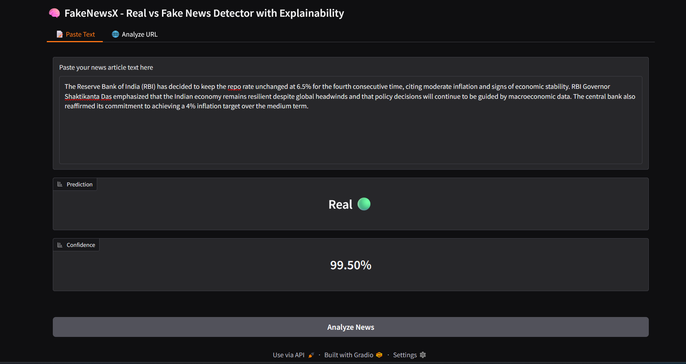

# 🧠 FakeNewsX: Real vs Fake News Detector with Explainability

FakeNewsX is an AI-powered news analysis tool that detects whether a news article is **Real** or **Fake** with high confidence using a fine-tuned BERT model. It also provides **LIME-based explainability**, helping you understand _why_ the model made its prediction.



---

## 🚀 Key Features

- ✅ Fine-tuned BERT for binary classification (Real vs Fake)
- 🔍 LIME explainability to highlight key decision words
- 📋 Paste text or analyze from a news **URL**
- 📊 Confidence score for predictions
- 🎨 Clean and interactive Gradio UI
- 🧠 Trained for 9 hours on 3 epochs (massive training time!)

---

## 🧠 What is "Explainability"?

Most AI models are black boxes 🔒 — they give you an answer but not the reason behind it.

**FakeNewsX uses LIME (Local Interpretable Model-agnostic Explanations)** to highlight important words in the text that influenced the decision, so you can **trust and verify** the model’s output.

---

## 📁 Project Structure

```
FakeNewsX/
├── app.py                   # Gradio frontend
├── utils/
│   └── predictor.py         # Prediction & LIME logic
├── model/
│   └── bert_fakenews_model.pt  # Trained model (not on GitHub)
├── data/                    # Dataset CSVs
├── assets/
│   └── example.png          # UI screenshot
├── requirements.txt
└── README.md
```

---

## ⚙️ Setup & Run Locally

### 1. Clone the Repo

```bash
git clone https://github.com/adarshts101/FakeNewsX.git
cd FakeNewsX
```

### 2. Install Dependencies

Make sure you have Python 3.10+ and pip installed.

```bash
pip install -r requirements.txt
```

### 3. Run the App

```bash
python app.py
```

It will launch in your browser at:  
👉 `http://127.0.0.1:7860`

---

## 🏷️ Sample Prediction

| Input News                                                                                                 | Output | Confidence |
|------------------------------------------------------------------------------------------------------------|--------|------------|
| *“The RBI has decided to keep the repo rate unchanged at 6.5%...”*                                         | ✅ Real | 99.5%      |
| *“Aliens from Jupiter hacked Indian satellites and caused rain in Chennai...”*                             | ❌ Fake | 99.9%      |

---

## 🔍 How It Works

- ✅ Uses HuggingFace's `bert-base-uncased` fine-tuned on fake vs real news
- ✅ Tokenizes and classifies input using `transformers.pipeline`
- ✅ LIME generates interpretability by perturbing inputs
- ✅ Gradio UI provides easy access via browser

---

## 🧠 Model Details

- **Architecture**: BERT (base, uncased)
- **Training**: 3 epochs (~9 hours)
- **Dataset**: Combined Fake & Real News dataset (Kaggle/Custom merged)

---

## 📦 Dependencies

```txt
torch>=2.7.1
transformers>=4.53.0
gradio
lime
pandas
numpy
scikit-learn
```

---

## ⚠️ Notes

- The `.pt` model is **not uploaded** to GitHub due to size limits (>500MB)
- You can upload it manually to the `model/` directory
- Or use a HuggingFace repo with `AutoModel.from_pretrained(...)`  

---

## 📡 Future Add-ons

- 🌐 Support for **live URL scraping** and analysis
- 📱 Deploy as a Web App with HuggingFace Spaces / Streamlit Sharing
- 🧪 Add XAI frameworks like SHAP or ELI5 for deeper insights

---

## 🧑‍💻 Author

Made with ❤️ by [Adarsh](https://github.com/adarshts101)  

---

## 🌐 Connect

🔗 [LinkedIn](https://www.linkedin.com/in/adarsh-ts-3b5a51323)  
💻 [GitHub](https://github.com/adarshts101)

---
